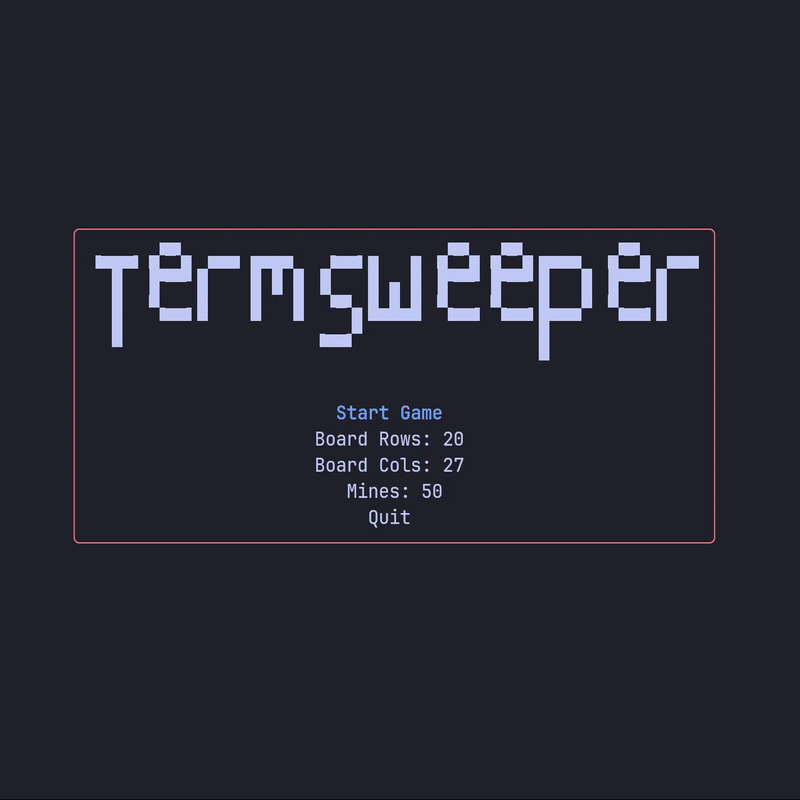
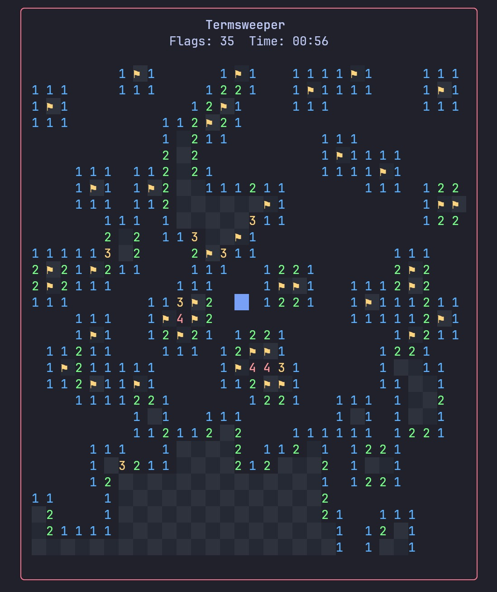

<div align="center">
<pre>
. ▗▄▄▄▖▗▞▀▚▖ ▄▄▄ ▄▄▄▄   ▗▄▄▖▄   ▄ ▗▞▀▚▖▗▞▀▚▖▄▄▄▄  ▗▞▀▚▖ ▄▄▄ .
.   █  ▐▛▀▀▘█    █ █ █ ▐▌   █ ▄ █ ▐▛▀▀▘▐▛▀▀▘█   █ ▐▛▀▀▘█    .
.   █  ▝▚▄▄▖█    █   █  ▝▀▚▖█▄█▄█ ▝▚▄▄▖▝▚▄▄▖█▄▄▄▀ ▝▚▄▄▖█    .
.   █                  ▗▄▄▞▘                █               .
.                                           ▀               .
<strong>Customizable Minesweeper TUI in Go</strong>
</pre>
</div>

TermSweeper is a TUI minesweeper game built with Go and the Bubble Tea TUI framework. It provides a clean, keyboard-driven interface, theming support, and a small set of configurable options.



## Features

- Terminal UI using Bubble Tea and Lip Gloss
- Classic Minesweeper mechanics: reveal, flag, and auto-reveal
- Timer, win/loss detection, and keyboard controls
- Configurable board size, mine count, and display characters
- Multiple color themes (see the Themes directory)

## Getting Started

Prerequisites: Go 1.20 or newer

Clone the repository and run locally:

```bash
git clone https://github.com/yourusername/termsweeper.git
cd termsweeper
go run main.go
```

Or build a standalone binary:

```bash
go build -o termsweeper ./
./termsweeper
```

Runtime debug flags:

- `--debug` : enable debug logging
- `--debug-file <path>` : write debug logs to the specified file

## Configuration

Configuration is loaded at startup (see `src/config.go`). An example config is provided at `Themes/example-config.yaml`.

Configurable items include board rows/columns, mine count, characters for mines/flags/unrevealed cells, and many color settings for cells and UI elements.

## Controls

Use arrow keys or Vim-keys keys to move the cursor. Primary controls:

- `R`: Reset the current board
- `F`: Toggle a flag on the highlighted cell
- `Q`: Quit the game (or return to the menu when in-game)
- `Space` / `Enter`: Reveal the highlighted cell (or auto-reveal neighbors when applicable)

## Themes & Assets

Theme files are stored in the `Themes` directory; several presets are included (catppuccin, dracula, gruvbox, rose-pine, tokyo-night).

### Tokyo Night Theme:



### Default theme:


# Contributing

Contributions are welcome! Open issues or pull requests for bugs, improvements, or new themes. If you prefer, feel free to fork the project and customize it for your needs.

## License

This project is licensed under the MIT License, see the [LICENSE](LICENSE) file for details.
